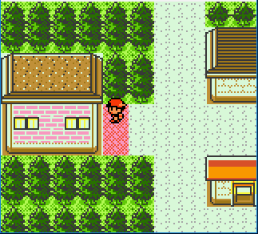

# Gen 2
## GS/C
* Gift Bot
* Static Bots (including Crystal Suicune)
* Wild Bots (including Legendary Beasts & Unown)
* Fishing Bot
* Headbutt Bot
* Egg Bot
* TID Bot
* Catching Bot
* Party Pokémon Info Viewer
* DayCare Viewer
* Wild Pokémon Viewer
* Roamer Tracker Viewer

## IMPORTANT!
* [VBA 23.6 RR 480-LRC4](https://github.com/TASEmulators/vba-rerecording/releases/tag/480LRC4) version required
* No Bizhawk versions are provided - these scripts are VBA only!

These Bots simply hunt for any combo of DVs that makes the Pokémon shiny. They work by making a save state that they then restore to if no match is found; you'll see this happening in your emulator's screen. Once a match is found the emulator is paused.

To start any of the Bots simply place yourself at the required final screen (as referred below) and Run the respective script

## Gift
Pokémon is generated after the nickname prompt (Y/N)

The final screen is: Put the cursor over "no" (nicknames not yet supported) and run the script

Valid for: Starters, Gifts and Game Corner prizes

## Static
Pokémon is generated as soon as the battle starts

The final screen is: Interact with the Pokémon and stop at their cry text or equivalent (before the last A press to initiate the battle) and run the script

A script for For Suicune (Crystal) specifically is included; the final screen for this is standing in front of the door of the Tin Tower. Run the script and it will walk in the building and start the encounter

A 'fastedit' version by SexyMalasada is included, which does not print the values of all the discarded ones on the Lua window, making the script run much faster

Valid for: Celebi, Ho-Oh, Lugia, Suicune (Crystal), Snorlax, Sudowoodo, Lapras, Electrode (Rocket Hideout)

## Wild
Pokémon is generated as soon as the battle starts

Edit the script for the desired species NatDex number at ``local desired_species =``. Alternatively use '-1' for any species

The final screen is: While in a grass patch with room to the right of the player, run the script. The Bot will walk back and forth right-left until it encounters a Pokémon and reset if not shiny

## Wild - Legendary Beasts
This is a modified wild script that hunts for the legendary beasts on Route 38. Emulator pause on shiny encounter is toggle-able by editing the value at ``local pause =``. The script can also automatically capture the beast, or you can stop the script and catch it yourself.

A 'fastedit' version by SexyMalasada is included, which does not print the values of all the discarded ones on the Lua window, making the script run much faster

The final screen is: Location between Ecruteak City and Route 38 to start:  

You can watch a video demo of the Script in action [here](https://www.youtube.com/watch?v=jFTGqBfL7aE)

## Fishing
Pokémon is generated as soon as the battle starts

Edit the script for the desired species NatDex number at ``local desired_species =``. Alternatively use '-1' for any species

The final screen is: Select your rod, put cursor over "Use" and run the script

## Headbutt
Pokémon is generated as soon as the battle starts

Edit the script for the desired species NatDex number at ``local desired_species =``. Alternatively use '-1' for any species

The final screen is: After being prompted to headbutt a tree, run the script at the ´Pokémon did a HEADBUTT!' text.

## Egg
Pokémon is generated at the last A press after depositing the second parent. The Egg itself is only generated after walking enough steps to do so

The final screen is: When the DayCare Man says 'Come back for it later.' run the script

For optimal breeding shiny odds (1/64) using a shiny Ditto is recommended!

## TID
The TID is generated immediately after pressing 'New Game'

Edit the script for the desired TIDs at ``local desired_tid =`` in decimal.

The final screen is: Place the cursor over 'New Game' at the main screen and run the script

## Catching
This bot throws poke balls until it catches the Pokémon

To use it place the cursor over 'Use' when selecting the Ball in the bag and run the script

## Various Viewer Scripts
These scripts are not bots but instead show on-screen information depending on which script you are using

If using the Roamer Tracker script, its location will be displayed as a number which corresponds to these locations:

Nature is based on experience points, so gaining experience points will change nature. You can find a detailed table of what experience values translate to each natures [here](https://www.pokemonrng.com/misc-3ds-transporter-nature-tables)

### Credits
These scripts were created based on zep715's original code, by wwwwwwzx
Source repo &amp; scripts by [wwwwwwzx](https://github.com/wwwwwwzx/gsclua/tree/master)

***
[< Back to the main page](https://github.com/Wi-Fi-Labs/PokeRNG-LuaScripts)